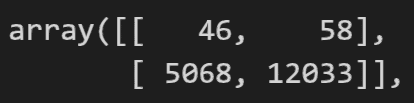
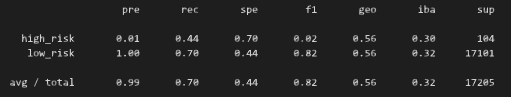
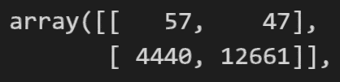
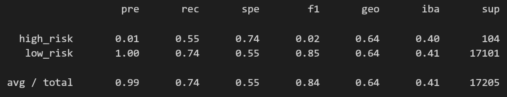
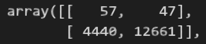
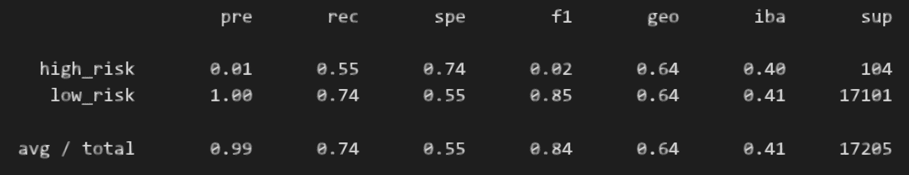
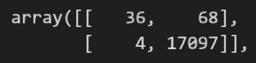
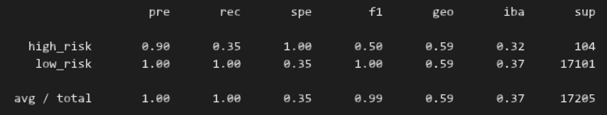
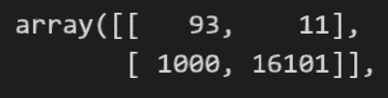
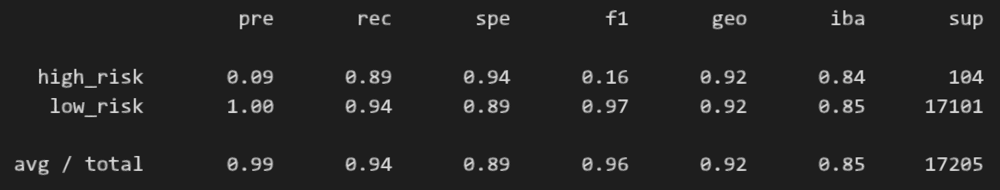

# Credit Risk Analysis
 
## Analysis

Our goal is to evaluate the performance of different machine learning models to determine whether any of these models should be used to predict credit risk. We will also determine which model is the best to use to predict credit risk.

## Results

### Naive Random Oversampler

- Balanced Accuracy Score: 0.57

- Confusion Matrix

- Classification Report
- 

### SMOTE Oversampling

- Balanced Accuracy Score: 0.64

- Confusion Matrix

- Classification Report
- 

### Undersampling

- Balanced Accuracy: 0.64

- Confusion Matrix

- Classification Report

### SMOTEEN Combination (Over & Under) Sampling

- Balanced Accuracy: 0.64

- Confusion Matrix

- Classification Report

### Random Forest Classifier

- Balanced Accuracy: 0.67

- Confusion Matrix

- Classification Report

 
### Easy Ensemble AdaBoost Classifier

- Balanced Accuracy: 0.92

- Confusion Matrix

- Classification Report

## Summary

Overall, each of the sampling options have weaknesses, though the Random Forest Classifier and Easy Ensemble Classifier ended up with very good precision and recall (and therefore good F1 scores). If I were to recommend one of these, the Easy Ensemble Classifier has the best scores, and generally has good accuracy.
